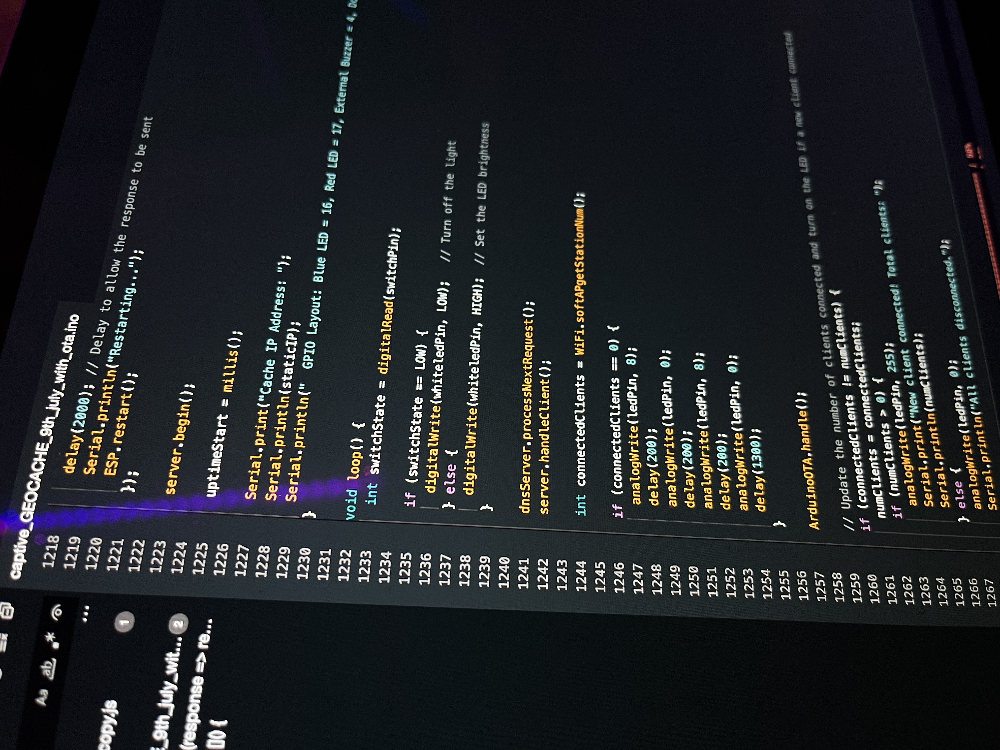
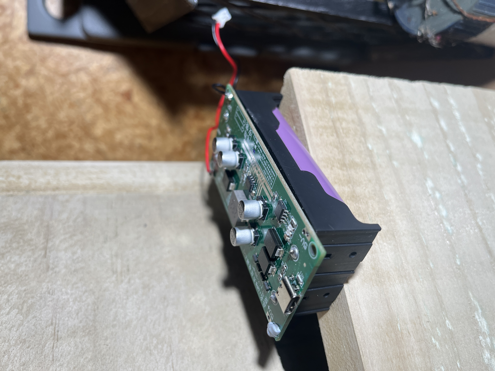
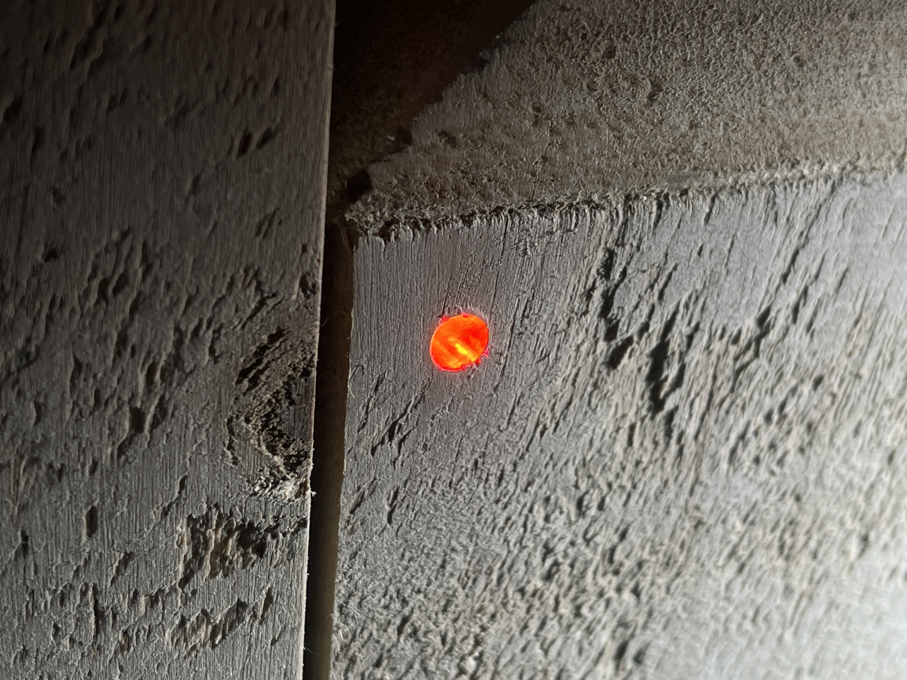

# help and troubleshooting (Geocaching page)
  

### status LED colours 

Red = loading/fault (100%)

Blue pulsing (4%)  = power on and successfully running.

solid blue (100%)  = Client Connected

### If you can't see the AP-wifi network:
Restart the device, and try another phone. Ensure the status Led is pulsing Blue if the controller led is not on contact me.

### Connected to AP but captive is not opening:
If your connected and the captive is still not opening forget the network and reconnect. If the issue persists go to the browser and type one of the following 4.3.2.1 or http://captive.apple, while on the network.

### Captive not sending java commands Lock/unlock commands:
please click settings in the top right corner, and click restart, once successfully reloaded it should emit a quick beep sound meaning AP is running. if this issue is still present the may be an internal error. 

### device won't power on:
This means the battery is probably low and can't power on, check solar panel is clean and not damaged. if no LEDs are on that means the controller is not running.

### cache led stuck on RED

the led should only remain red for a second or two when pressed meaning it's starting. it it stays red it means something went wrong with the config. 

